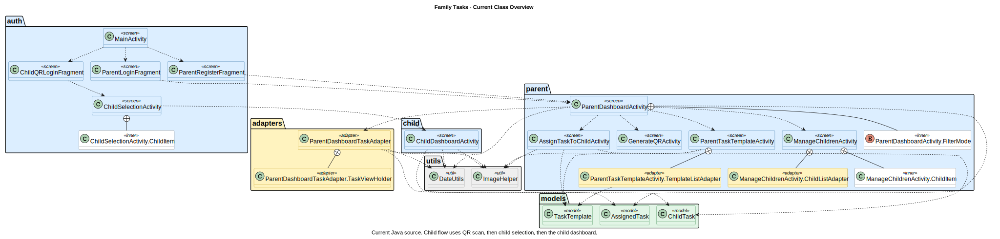
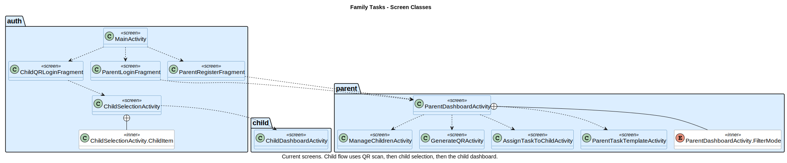
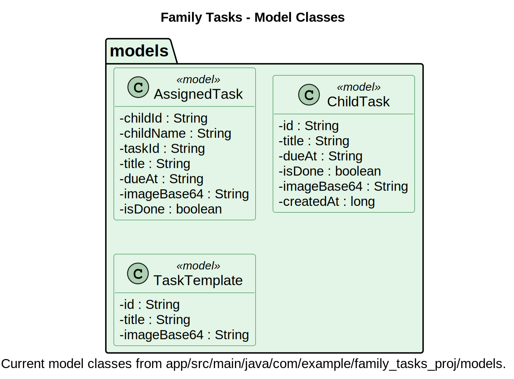
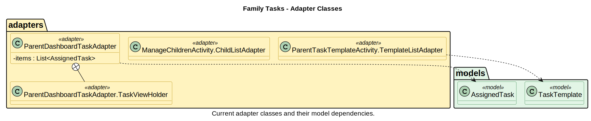
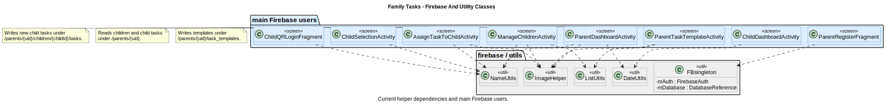

# Class Diagram Section - Family Tasks

Generated from real Java source using JavaParser and PlantUML.

## Full Overview

תרשים המחלקות נוצר מתוך קוד הפרויקט בעזרת תוסף UML מתאים. התרשים מציג את המחלקות המרכזיות בפרויקט ואת הקשרים ביניהן. במקומות שבהם התרשים היה עמוס מדי, חולק התרשים למספר תרשימים נפרדים כדי לשמור על קריאות ברורה גם בגרסת ה־PDF.

## Screen Classes

תרשים המחלקות נוצר מתוך קוד הפרויקט בעזרת תוסף UML מתאים. התרשים מציג את המחלקות המרכזיות בפרויקט ואת הקשרים ביניהן. במקומות שבהם התרשים היה עמוס מדי, חולק התרשים למספר תרשימים נפרדים כדי לשמור על קריאות ברורה גם בגרסת ה־PDF.

## Model Classes

תרשים המחלקות נוצר מתוך קוד הפרויקט בעזרת תוסף UML מתאים. התרשים מציג את המחלקות המרכזיות בפרויקט ואת הקשרים ביניהן. במקומות שבהם התרשים היה עמוס מדי, חולק התרשים למספר תרשימים נפרדים כדי לשמור על קריאות ברורה גם בגרסת ה־PDF.

## Adapter Classes

תרשים המחלקות נוצר מתוך קוד הפרויקט בעזרת תוסף UML מתאים. התרשים מציג את המחלקות המרכזיות בפרויקט ואת הקשרים ביניהן. במקומות שבהם התרשים היה עמוס מדי, חולק התרשים למספר תרשימים נפרדים כדי לשמור על קריאות ברורה גם בגרסת ה־PDF.

## Utils / Firebase Classes

תרשים המחלקות נוצר מתוך קוד הפרויקט בעזרת תוסף UML מתאים. התרשים מציג את המחלקות המרכזיות בפרויקט ואת הקשרים ביניהן. במקומות שבהם התרשים היה עמוס מדי, חולק התרשים למספר תרשימים נפרדים כדי לשמור על קריאות ברורה גם בגרסת ה־PDF.
